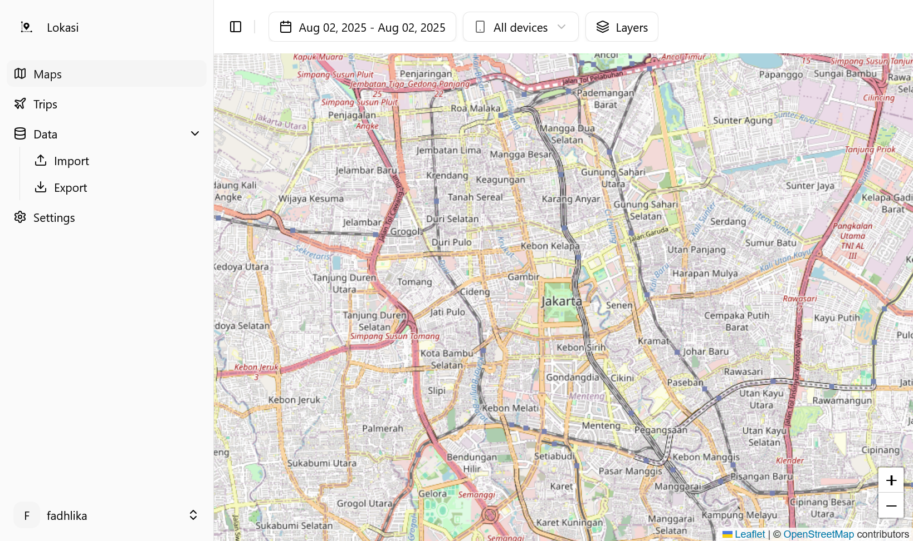

#  Lokasi

Self-hosted location tracking history

## Features

### Implemented

- Track your locations using Owntracks/Overland
- Create trip to visualize your locations in defined time
- Import from Dawarich
- Reverse geocode tracked locations
- Support Owntracks features
  - Tours (iOS)
    - Tours are Trip in Lokasi, when create tour from Owntracks app it will create trip in Lokasi
    - Need to enable remote command, you can do this by export settings, edit `cmd` to `true` in `config.otrc`, then open the config in Owntracks.
  - MQTT
    - Only use for location message for now
- Single container deployment, no need to deploy database(s) or any other service

### Planned

- Share trip from web, currently only via Tours on Owntracks iOS app
- Share real-time location (similar to Friends in owntracks)
- Full Owntracks implementation

## Screenshots

